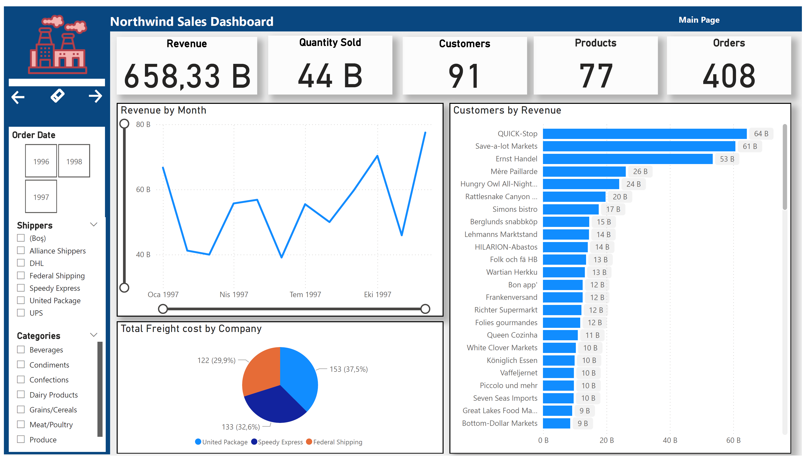
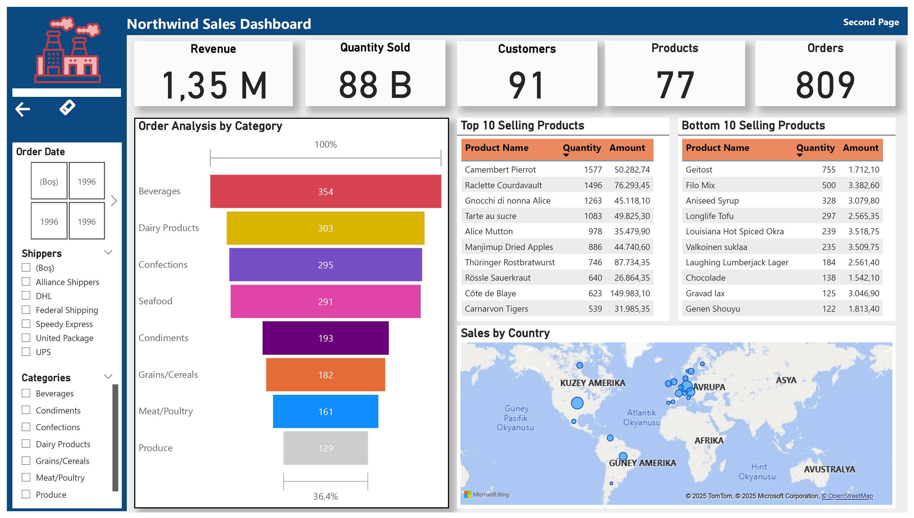

# 📊 Power BI Dashboard – Insight Bootcamp Projesi

Bu proje, [Techcareer.net](https://techcareer.net) tarafından düzenlenen **Insight Power BI Bootcamp** kapsamında geliştirilmiştir. Eğitimin sonunda verilen veri seti üzerinde çalışılarak, temel iş zekâsı analizleri gerçekleştirilmiş ve kullanıcı dostu bir dashboard tasarlanmıştır.

## 🎯 Amaç

Dashboard ile iş birimleri için karar destek süreçlerine katkı sağlayacak analizler sunulması hedeflenmiştir. Projede;

- KPI takibi
- Zaman bazlı trend analizi
- Segmentasyon ve filtreleme
- Etkileşimli görseller

yer almaktadır.

## 🛠️ Kullanılan Teknolojiler

- Power BI Desktop
- Power Query (veri temizleme & dönüştürme)
- DAX (hesaplamalı alanlar, metrikler)
- Veri modelleme (one-to-many ilişkiler, tablo ilişkileri)

## 📁 Dosya İçeriği

| Dosya/Klasör | Açıklama |
|--------------|----------|
| `dashboard.pbix` | Power BI proje dosyası |
| `assets/` | Dashboard'a ait ekran görüntüleri |
| `README.md` | Proje açıklaması |
| `data/` (opsiyonel) | Veri seti (kamuya açık ise eklenebilir) |

## 🖼️ Dashboard Görseli

 
 

> Görsel temsili olup, Power BI dosyasını indirerek etkileşimli olarak inceleyebilirsiniz.

## 🧩 Öğrendiklerim

- Veriyi sadece göstermek değil, **anlamlı hale getirmek** gerektiğini fark ettim.
- Power BI’da **kullanıcı deneyimi** ve **veri hikayesi** sunumunun ne kadar önemli olduğunu deneyimledim.
- DAX fonksiyonlarının iş zekâsı kurgusunda ne kadar güçlü olduğunu öğrendim.

## 📌 Notlar

- Veri seti eğitmen tarafından örnek amaçlı sağlanmıştır.
- Proje, kişisel öğrenim ve portfolyo amacıyla paylaşılmıştır.

## 📬 İletişim

Bu proje veya Power BI ile ilgili deneyim paylaşımı için bana ulaşabilirsiniz:

[LinkedIn Profilim](https://www.linkedin.com/in/gokhanyavas)

